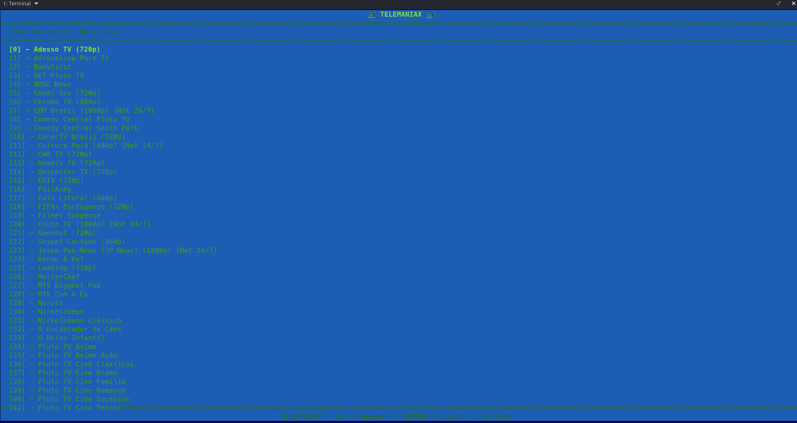
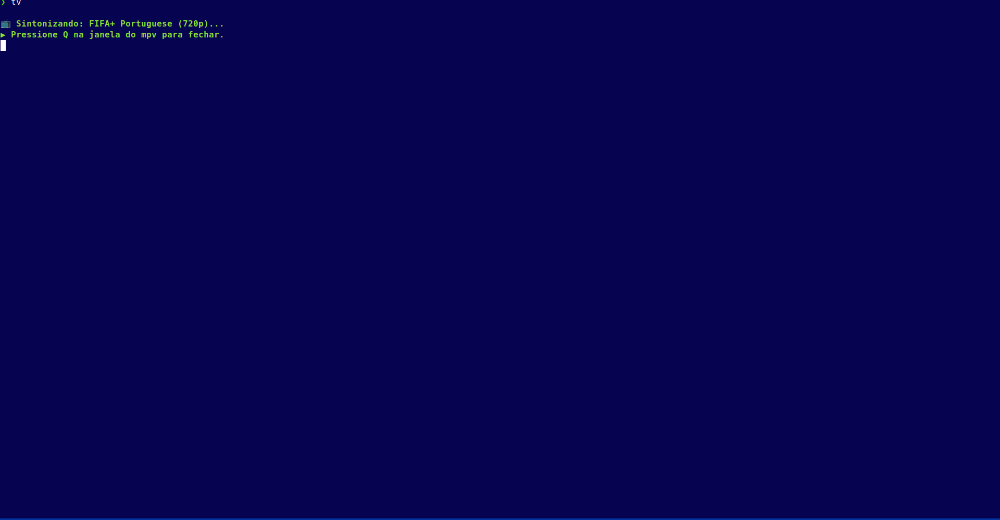
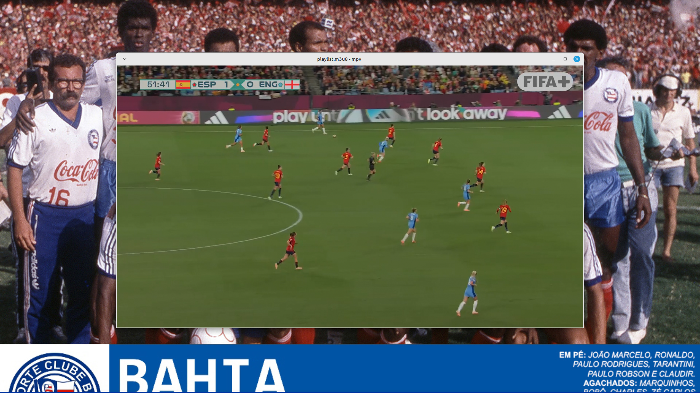

# 📺  TELEMANIAX

> *Um projeto feito unindo duas coisas que eu amo de paixão: Computação e Televisão Brasileira. Um catálogo interativo que transforma o seu terminal Linux na sua TV, desde as emissoras mais famosas até as regionais. Feito de fã para fãs da TV BR.*

## 🚀 Porque o criei?

Acredito que você neste momento se esteja a perguntar: *"Porque raios criarias um catálogo de TV no Linux com outras ferramentas no mercado?"*

Acredito que não só eu, mas toda a comunidade Linux (principalmente no Brasil), preze por duas coisas importantíssimas para o pleno funcionamento do hardware: **Fluidez e baixo consumo de processamento**.

Ferramentas como o Hypnotix, além de terem uma GUI pesada, costumam carregar listas de IPTV de canais de todo o mundo. Apesar de ser algo extremamente vistoso para quem não conhece e muito legal para fãs de TV como eu, é um programa pesado e sofre com demora a carregar alguns canais. Criei o **Telemaniax** com uma interface de terminal com foco total na **otimização de processamento** e numa **simplicidade extrema**, no conforto do seu terminal Linux!

## ✨ Funcionalidades

Sendo extremamente breve, o Telemaniax possui um:

- 📺 **Vasto catálogo de canais BR** reproduzidos num player mpv.

- ⚡ **Alta performance:** Sem engasgos de GUI, garantindo otimização do sistema.

- 🎬 **Qualidade de reprodução:** Alta qualidade de transmissão ao vivo.

- ⌨️ **Navegação imersiva:** A experiência de ver televisão combinada com a simplicidade do terminal.

## 🛠️ Stack Técnica Completa

Um guia detalhado da arquitetura, bibliotecas e ferramentas que compõem o controlo remoto de IPTV para terminal Telemaniax.

### 🖥️ 1. Ambiente e Sistema Operativo

- **Sistema Operativo:** Linux (Compatível com qualquer distribuição baseada em Debian/Ubuntu, Arch, Fedora, etc.).

- **Terminal/Emulador:** Testado com sucesso em emuladores modernos (como o Tilix), tirando partido dos seus esquemas de cores.

- **Linguagem Principal:** Python 3 (A espinha dorsal de toda a lógica do programa).

- **Gestão de Dependências:** `venv` (Módulo nativo do Python usado para criar um ambiente isolado e não sujar o sistema operativo com bibliotecas globais).

### 🎬 2. Motor Multimédia (O "Backend" de Vídeo)

A dupla dinâmica responsável por reproduzir os canais e fazer a magia acontecer fora do terminal:

- **`mpv`**: Um reprodutor de vídeo de linha de comandos extremamente leve, poderoso e de código aberto. É ele que abre a janela de vídeo em ecrã inteiro.

- **`yt-dlp`**: Uma ferramenta de linha de comandos. O *mpv* utiliza-a nativamente por trás dos panos para "desempacotar" e resolver streams complexas (como emissões ao vivo do YouTube ou links HLS/m3u8 encriptados) antes de as reproduzir.

### 🌐 3. Fontes de Dados e Rede (Consumo de API)

- **Repositório Base:** [iptv-org/iptv](https://github.com/iptv-org/iptv "null") (Um projeto gigantesco no GitHub gerido pela comunidade que compila listas públicas de IPTV de todo o mundo de forma legal).

- **URL Específica:** O ficheiro `.m3u` que contém os dados de todos os canais do Brasil.

- **Rede:** Biblioteca Python `requests` utilizada para fazer o pedido HTTP (download) do ficheiro diretamente do GitHub para a memória do programa.

### 🧠 4. Lógica de Negócio e Segurança (O Core do Script)

- **Parser Customizado M3U:** Lógica em Python puro construída para ler ficheiros de texto linha a linha, procurar a tag `#EXTINF` e extrair o nome, a categoria (`group-title`) e a URL do canal.

- **Sistema de Overrides (Bypass):** Um dicionário Python criado para intercetar canais específicos (como a rede Record, que possui Geo-Block) e substituir o link M3U falhado pela transmissão oficial correspondente no YouTube.

- **Sistema de Blacklist:** Um conjunto (`set`) Python para filtrar e descartar silenciosamente dezenas de canais religiosos, locais irrelevantes ou offline, limpando a interface.

- **Táticas de Anti-Hotlinking e Disfarce de Rede:**
  
  - **User-Agent Falso:** Envio do cabeçalho do Google Chrome para evitar bloqueios "404 Not Found" destinados a bots e terminais.
  
  - **Injeção de Cabeçalhos (Headers):** Envio de `Referer` e `Origin` falsos para o mpv contornar os erros "400 Bad Request" em servidores baseados em publicidade.
  
  - **Módulo `uuid`:** Utilizado para gerar IDs de dispositivo (*Device ID*) falsos na hora, enganando servidores que exigem rastreamento.

### 🎨 5. Interface Gráfica e Interatividade (O "Frontend")

A escolha pelo purismo do terminal. Em vez de interfaces baseadas em "prints", o projeto utiliza um motor de manipulação de ecrã a baixo nível com a biblioteca **`curses`**:

- **Controle Total:** Toma o controlo total do terminal, substituindo a rolagem padrão por um ecrã interativo "congelado", permitindo uma verdadeira experiência de software imersivo.

- **Gestor de Ecrã (`stdscr`):** Desenha e fixa o cabeçalho (com contagem de canais) e o rodapé (com os comandos de atalho) de forma estática.

- **Loop de Eventos (`getch`):** Sistema de escuta em tempo real que captura a pressão das setas do teclado (UP/DOWN) para uma navegação instantânea e sem lag.

- **Motor de Paginação (Scroll):** Uma lógica matemática baseada em offset que calcula dinamicamente quantos canais cabem na altura atual do seu terminal, empurrando a lista para cima ou para baixo quando o cursor chega ao limite do ecrã.

- **Color Pairs (Pares de Cores):** Utilização nativa do motor de cores do terminal para destacar (`A_REVERSE` ou cores específicas) a linha do canal que está atualmente focado.

### ⚙️ 6. Integração com o Sistema

- **O Comando Mágico:** A criação de um alias (ex: `alias tv="python3 ~/Documentos/telemaniax/telemaniax.py"`) no ficheiro `.bashrc` ou `.zshrc` do Linux. Isto transforma o script Python complexo num comando de sistema nativo, permitindo "ligar a TV" digitando apenas duas letras em qualquer terminal aberto.

- **Tratamento de Interrupções:** Gestão elegante do `KeyboardInterrupt` (Ctrl+C) para garantir que o terminal não fica desconfigurado ("sujo") quando o utilizador aborta a aplicação de forma forçada, devolvendo o controlo limpo à shell.

> *"Resumo da Obra: Uma stack purista, leve e incrivelmente rápida. Sem bases de dados pesadas ou frameworks complexos. Apenas a sintonia perfeita entre o Python nativo, a manipulação de matrizes de ecrã com o curses e o poder de reprodução do mpv."*

### 📸 7. O Telemaniax em Ação

* Confira abaixo algumas capturas de tela e demonstrações do projeto rodando na prática, mostrando a interface fluida e a reprodução dos canais direto do conforto do terminal:

# Estrutura de Seleção de Canais

# Sintonização

# Exibição

